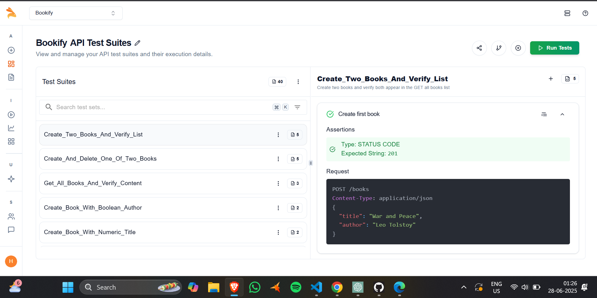

## 🧪 Keploy API Testing Report

This project uses [Keploy](https://keploy.io/) for AI-powered API Testing.  
Test suites are automatically run in CI using GitHub Actions.

### ✅ Test Report Screenshot

---

## ⚙️ CI/CD Configuration

This repository uses **GitHub Actions** for CI/CD.  
You can find the Keploy testing pipeline in:

📁 [`.github/workflows/keploy-ci.yml`](.github/workflows/keploy-ci.yml)

Keploy tests are triggered on:
- `push` to `main`
- Pull requests
- Manual runs (`workflow_dispatch`)
